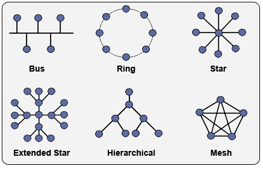
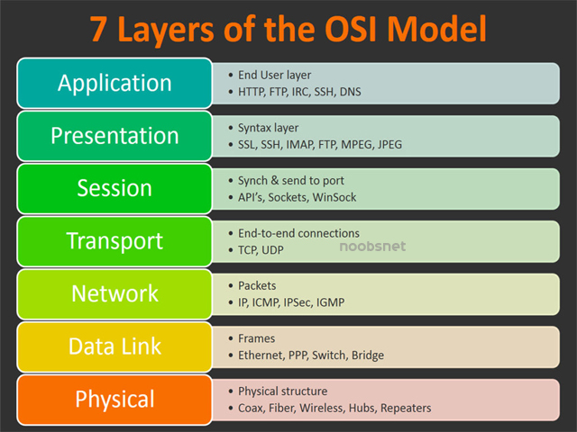
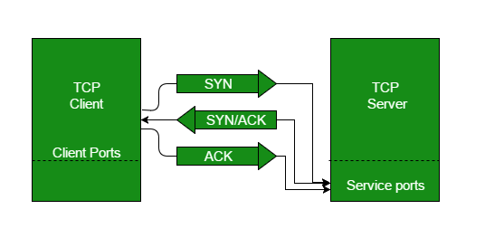

# Security Fundamentals 

The topic of Cybersecurity is expansive, I'm trying to build out this repository of fundamentals that would be easy for me to refer to in the future as a refresher. I'm updating the notes as I go/learn about them. 

## Table of Contents 

* [OWASP Top 10](#OWASP-Top-10)
* [Fundamentals](#Fundamentals)
* [Encryption](#Encryption)
* [Networking](#Networking)
* [Databases](#Databases)
* [Forensics](#Forensics)
* [Nmap](#Nmap)
* [Terms/Glossary](#Terms)

## OWASP Top 10 

Open Web Application Security Project (OWASP) releases a list of the top 10 most seen vulnerabilities every couple of years. You can refer to the most current list here: [OWASP Website Top 10](https://owasp.org/www-project-top-ten/)

1. **Injection** 

	* SQL, NoSQL, OS, and LDAP injection when it’s sent to the interpreter as part of the query 
Execute unintended commands or accessing data without proper authorization
2. **Broken Authentication** 

	* Authentication and session management are implemented incorrectly, allowing attackers to compromise passwords, keys, or session tokens
	*  Or an attacker is able to take over a users’ identity 

3. **Sensitive Data Exposure** 
	
	*  APIs don't’ really protect sensitive data (financial, healthcare, PII) 
	*  Should have encryption in place in rest, transit 

4. **XML External Entities (XEE)**

	* 	External Entities can be used to disclose internal files using the URI handler, internal file shares, internal port scanning, remote code execution, and denial of service attacks
5. **Broken Access Control**

	* Restrictions on what authenticated users are allowed to do 
	* View sensitive files, modify another user’s data, change access rights

6. **Security Misconfiguration**

	* Most commonly seen issue 
	* Using default configurations, incomplete/ad hoc configurations, open cloud storage, or misconfigured HTTP headers 
	* Systems should be patched and upgraded in a timely fashion 

7. **Cross-Site Scripting XSS** 

	* When an application includes untrusted data in a web page without validation/escaping 
	* Allows attackers to execute scripts in the victim’s browser where their session can be hijacked, deface websites, or redirect the user to a malicious site

8. **Insecure Deserialization**

	* Leads to remote code execution 
	* Can lead to replay attacks, injection attacks, and privilege escalation attacks 

9. **Using Components with Known Vulnerabilities**

	* Using libraries and components with known vulnerabilities 
	* Make sure to keep them up to date

10. **Insufficient Logging & Monitoring**

	* Insufficient logging and monitoring with missing/ineffective integration of incident response allows attackers to further attack systems 
	* Should be able to have your own systems detect that there has been a breach rather than an external entity finding out about it 

## Encryption 

* Asymmetric encryption - use **two keys**, one to encrypt the information and another to decrypt information
	* used for regular encryption and digital signatures 
	* Example: RSA 
* Symmetric encryption - use **one key** to encrypt and decrypt 
	* Both parties must somehow have the same key 

## Fundamentals 

### CIA Triad 

* **Confidentiality** - ensuring that sensitive data is access only by an authorized user 
* **Integrity** - data integrity (that it hasn't been modified improperly)
* **Availability** - ensure that the data/resources are available to users when it's needed

### AAA 

Authentication, Authorization, and Accounting

System for tracking user activities on an IP-based network and controlling their access to network resources. Typically it's implemented as a dedicated server. 

### Other Fundamentals 

* What are the goals of security? 
	* Prevention - stop the attack from happening 
	* Detection - know when the attack is happening 
	* Recovery - stop, assess, repair, and maintain functionality 
* What is the difference between a threat, attack, vulnerability, exploit, and risk?
	* **Threat** - something that you can protect agains, can be natural or man made  
	* **Attack** - actions that take advantage of potential threats 
	* **Vulnerability** - weakness or gap
		* Can be technical, operational, or managerial
	* **Exploit** - 
	* **Risk** - 
* What are the 3 types of Authentication and provide an example of each: 
	* What you Know - ex: Password 
	* Something you have - ex: Card 
	* Something you are - ex: Fingerprint

## Networking 

### Networking Topologies 

* Bus Topology - nodes are all connected to a single connection 
* Star Topology - nodes are connected to a single point, single point of failure (middle node)
	* Sometimes referred to as hub-and-spoke 
* Mesh Topology - multiple point-to-point connections that connect each location to others (full mesh & partial mesh) 

### OSI Model 

* Acronym for OSI: All People Seem To Need Data Processing 

| Layer  | Name  | Example  |
|---|---|---|
| 7 (Data)  | **Application** (UI Layer)  | Bear Naked  |
| 6 (Data)  | **Presentation** (responsible for formatting data so that the App Layer can recognize and work with it. Ex: .doc, .jpg, .txt   | BearNaked.jpg  |
| 5 (Data)  | **Session** Initiates & Terminates Network Connection  | BearNaked.jpg <FTP login>  |
| 4 (Segment)  | **Transport** TCP vs UDP   | BearNaked.jpg <FTP login> TCP  |
| 3 (Packet) | **Network** Deals with IP Address  | BearNaked.jpg <FTP login> TCP IP   |
| 2 (Frame)  | **Data Link** Prepares a frame for the packet to be transmitted | BearNaked.jpg <FTP login> TCP IP Ethernet  |
| 1 (Bits)  | **Physical** Physical bits (0s and 1s)  | <converts to binary>  |

### TCP vs UDP

| TCP   | UDP  |
|---|---|
|Transmission Control Protocol | User Design Protocol  |
| Connection Oriented  | Connectionless   |
| Uses 3 Way Handshake | Faster than TCP  |
| Error Handling to guarantee message delivery| No Error Handling  |
| Example: Sending messages | Example: Streaming  |

### 3-Way Handshake

The 3-Way Handshake is part of the TCP. 

* Provides reliable communication with PAR (Positive Acknowledgement with Re-transmission)
	* Will continue to send the data until it receives an acknowledgement that the packet was received

1.  SYN - Synchronize Sequence Number 
	*  Informs the server that the client wants to start communication
2.  SYN + ACK - (ACK = Acknowledgement)
	*  Server acknowledges that the connection request was received and sends an acknowledgement 
3. ACK - final part where the client acknowledges the response of the server and the reliable connection is established 

Source: [GeeksforGeeks](https://www.geeksforgeeks.org/tcp-3-way-handshake-process/)

### Important Ports to Take Note of 

| Port Number  | Port Function  |
|---|---|
|  21 |  FTP - File Transfer Protocol |
|  22 |  SSH - Secure Shell|
|  23 |  Telnet |
|  25 |  SMTP |
|  53 |  DNS |
|  80 |  HTTP |
|  110 | POP3  |
|  111 | RPCBind  |
|  143 | IMAP  |
|  443 | HTTPS  |
|  3306 | MYSQL  |
|  8080 | HTTP Proxy  |
|   |   |
|   |   |
|   |   |

Source: [Top Scanned Ports](https://securitytrails.com/blog/top-scanned-ports)

### Other Networking Questions 

* What's the difference between a static & dynamic IP address? 
	* **Dynamic IP** - assigned via DHCP (Dynamic Host Configuration Protocol) and can change 
	* **Static IP** - manually assigned by the user/system admin
* What is a Gateway? 
	* Single point in a network that connects to the public Internet
* What is SSL? 
	* Secure Sockets Layer - encrypts connection between the web server and the web browser
* What does the green lock on a website mean? 
	* Green Lock means that your browser is able to verify that the web site that you are visiting has been verified by a 3rd party certificate authority (so they are who they say they are, it's not a malicious website that you've been re-routed to) 
	* Uses port 443 vs port 80
* What is the difference between SSL and TLS? 
	* SSL - helps you track the person that you're communicating with 
	* TLS - creates a secure channel between the two clients 

### Networking Terminology 

* **Content Network** - makes accessing information faster (closer nodes to clients) 
	* Used by Netflix 
* **LAN** - Local Area Network 
	* Network within a small area (typically a room/floor/building)
* **NAT** - Network Address Translation 
	* Helps the router decide where to send the packages
* **PAR** - Positive Acknowledgement with Re-transmission 
	* Part of TCP that will ensure that packets were sent 
* **WAN** - Wide Area Network 
	* Connects 2/+ LANS 
	* 4 types of WAN Technologies 
		* Dedicated Leased Line - expensive, but you can control everything
		* Circuit-Switched Connections - phone company as service provider, slower connection 
		* Packet-Switched Connections - connect to provider's network, traffic is affected by others 
		* Cell-Switched Connections - unit size of data being sent if a fixed cell, it's more efficient with dealing w/ traffic loads 

## Databases	

* Prevention against SQL Injection Attacks
	* Input Validation - escape characters, and sanitize 
	* Dynamic SQL - don't let the user's query execute, use prepared statements, parameterized queries, or store procedures instead 
	* Update and patch - make sure it's all up to date 
	* Firewall - can help filter out malicious data 
	* Reduce your attack surface - disable any features/functionality that you don't need to prevent an attacker from taking advantage of it 
	* Checking privileges - make sure that the user has the privileges required to execute the query 
	* Logging/Monitoring 

Sources: 

* [Prevention against SQL Injection](https://www.esecurityplanet.com/threats/how-to-prevent-sql-injection-attacks/)
* [OWASP Injection CheatSheet](https://cheatsheetseries.owasp.org/cheatsheets/SQL_Injection_Prevention_Cheat_Sheet.html)
## Forensics 

* What are the 3 types of investigations and what are the differences between them? 
	* **Internal** - internal to the organization 
		* ex: employee possessing unauthorized documents 
	* **Civil** - two parties in a civil suit 
		* ex: employee suing for wrongful termination
	* **Criminal** - criminal lawsuit filed by a prosecutorial agency 
* What are the **golden rules of digital forensics?**
	* **Protect and Preserve the evidence** - an exact copy must be made of the original digital media (forensic image)
	* **Always assume the case will go to court** - keeping track of an asset (chain of custody), and matching cryptographic hashes for original evidence and forensic image
* What is ARP? 
	* Address Resolution Protocol 
	* Used for associating a MAC address with an IPv4 Address 
	
## Nmap 

Network Mapper ([Nmap](https://nmap.org/)) is used for network discovery, I'm not going to build out a cheatsheet on it/a run down of all the things that it can do because [Jason Niebauer](https://github.com/jasonniebauer) has already put together a cheatsheet for reference 

[Jason Niebauer's Nmap Cheatsheet](https://github.com/jasonniebauer/Nmap-Cheatsheet)

* Find the IP address of your Mac: `ipconfig getifaddr en0` 
* Find the IP address of your PC: `ipconfig`

## Terms 

* **CSMA/CD** - Carrier-Sense multiple access with collision detection 
	* How network devices respond when there are 2 devices that attempt to use the same data channel at the same time 
	* If a collision occurs, a jam signal is sent 
* **CSRF** - Cross Site Request Forgery
* **DHCP** - Dynamic Host Configuration Protocol
* **Salt** - adding more characters to something to make it more secure 
* **WAF** - Web Application Firewall 
	* used to help filter incoming and outgoing traffic 
* **XXE** - XML External Entity

## Sources 

